# 🧠 NLP Sentiment Intelligence System (Twitter)

## 📌 Project Overview

This project builds a complete Natural Language Processing (NLP) and Machine Learning pipeline to analyze Twitter text data and predict whether a tweet expresses Positive or Negative sentiment.

The project uses the real-world Sentiment140 dataset containing 1.6 million tweets. The goal is to understand public opinion, analyze social media behavior, and build a sentiment prediction system using NLP techniques and Machine Learning models.

---

---

# 🎯 Project Objective

- Predict whether a tweet expresses Positive or Negative sentiment
- Analyze social media text behavior using NLP
- Identify important positive and negative sentiment words
- Compare multiple Machine Learning models
- Generate business insights from large-scale Twitter data

---

# 🛠️ Technologies Used

## 📚 Libraries

- pandas
- numpy
- matplotlib
- seaborn
- nltk
- wordcloud
- scikit-learn
- joblib

---

# 📂 Dataset Information

The project uses the **Sentiment140 Twitter dataset** containing:

- 1.6 Million real tweets
- Raw Twitter text
- Sentiment labels
- Tweet metadata
- User information
- Timestamp information

### 🎯 Target Variable

| Value | Meaning |
|---|---|
| 4 | Positive Tweet |
| 0 | Negative Tweet |

---

## 🔄 Project Workflow

**Raw Twitter Dataset → Data Cleaning → Text Preprocessing → NLP EDA → Word Analysis → TF-IDF Vectorization → Machine Learning → Model Evaluation → Sentiment Prediction → Business Insights**

---

# 🧹 Text Cleaning & Preprocessing

The project includes advanced NLP preprocessing techniques such as:

- Lowercase conversion
- URL removal
- Mention removal
- Hashtag cleaning
- Number removal
- Punctuation removal
- Stopword removal
- Lemmatization
- Extra space cleaning

---

# 📊 Exploratory Data Analysis

The project includes analysis on:

- Sentiment Distribution
- Tweet Length Distribution
- Word Count Analysis
- Positive Word Frequency
- Negative Word Frequency
- WordCloud Analysis
- Bigram Phrase Analysis
- Important Sentiment Words

---

# 📷 Project Images

## 📌 Sentiment Distribution
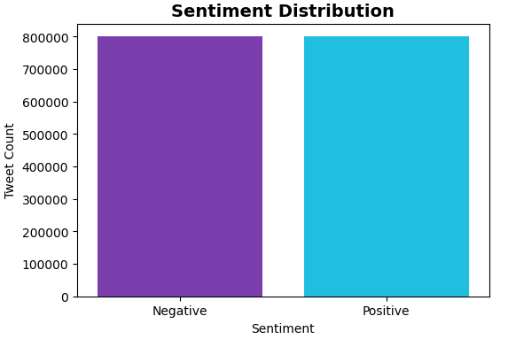

## 📌 Tweet Length Distribution
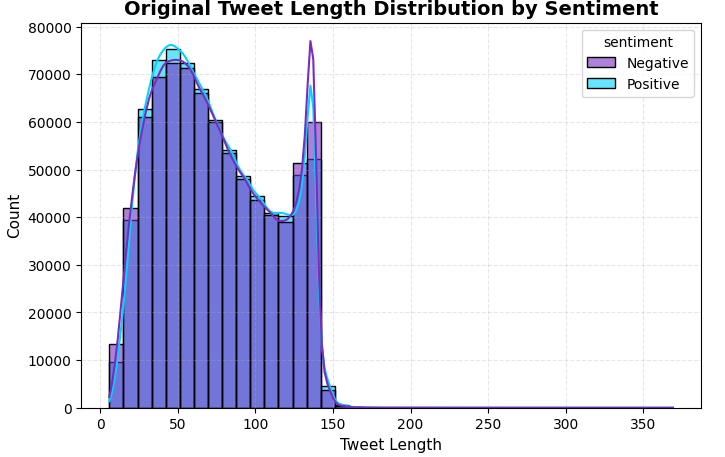

## 📌 Top Positive Words
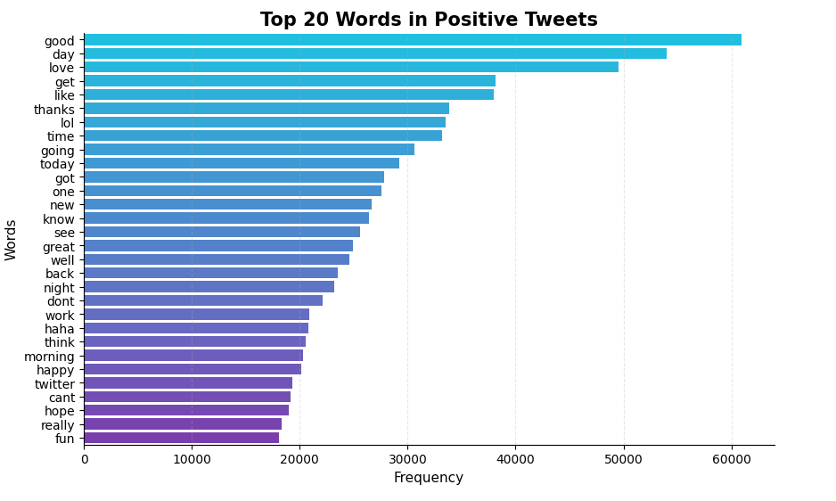

## 📌 Top Negative Words
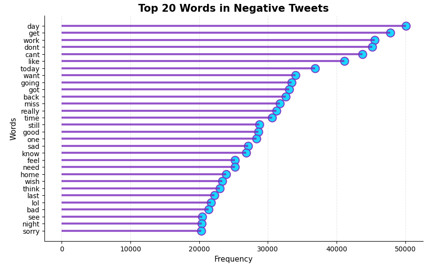

## 📌 Positive Tweet WordCloud
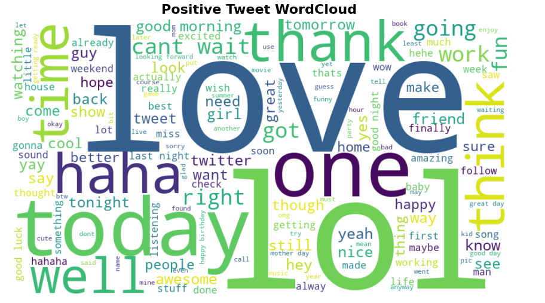

## 📌 Negative Tweet WordCloud
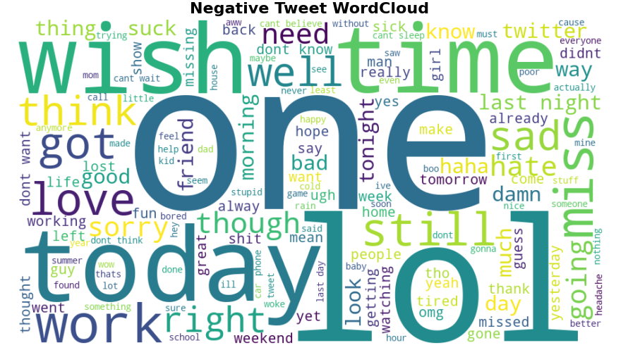

## 📌 N-Gram Phrase Analysis
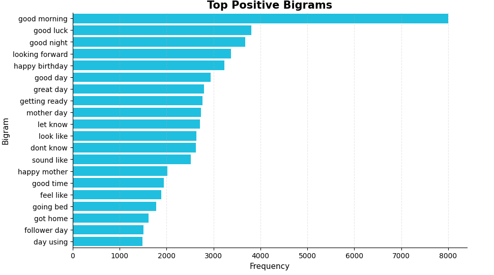

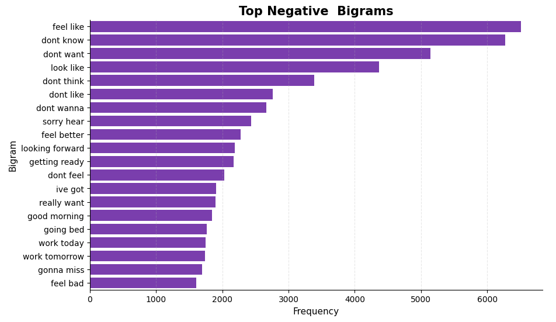

## 📌 Confusion Matrix
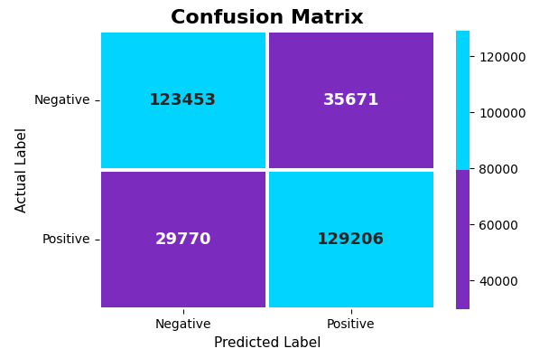

## 📌 ROC Curve & AUC Score
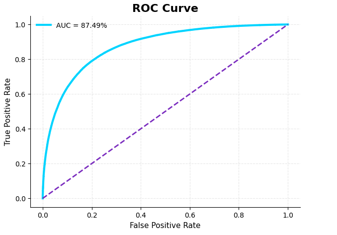

## 📌 Top Positive & Negative Sentiment Words
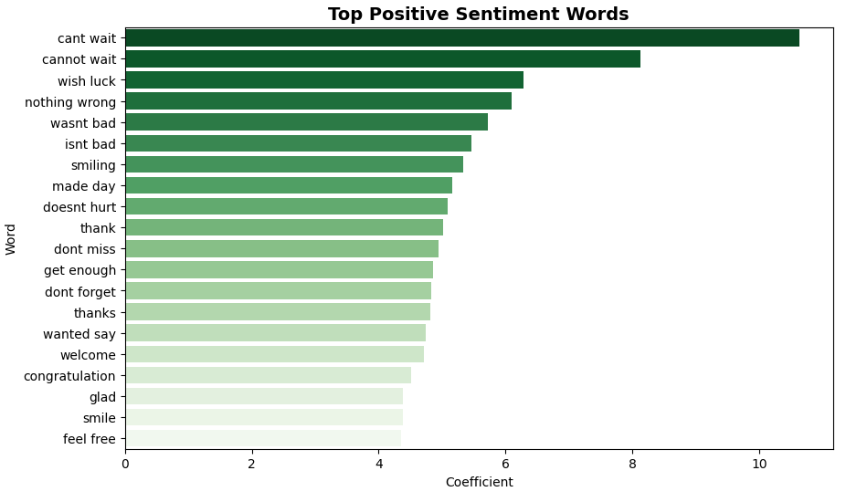

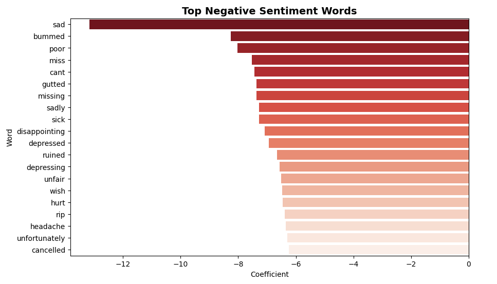

---

# ⚙️ NLP Feature Engineering

Created NLP-focused features and transformations such as:

- Clean Text Generation
- Tweet Length Features
- Word Count Features
- TF-IDF Features
- Bigram Features
- Sentiment Word Extraction
- Important Word Analysis

---

# 🤖 Machine Learning Models

## Models Used

- Naive Bayes
- Logistic Regression
- Linear SVM

---

# ⚙️ Data Preprocessing

The preprocessing pipeline includes:

- Train-Test Split
- TF-IDF Vectorization
- N-Gram Feature Extraction
- Text Normalization

---

# 📈 Model Performance

| Model | Accuracy | Precision | Recall | F1 Score |
|---|---|---|---|---|
| Naive Bayes | 77.67% | 77.66% | 77.67% | 77.67% |
| Logistic Regression | 79.43% | 78.37% | 81.27% | 79.79% |
| Linear SVM | 79.11% | 77.87% | 81.31% | 79.55% |

---

# 🏆 Best Model

## Logistic Regression

### Final Performance

| Metric | Score |
|---|---|
| Accuracy | 79.43% |
| ROC-AUC Score | 0.87 |

---

# 🔥 Key Business Insights

- Positive tweets mostly contain words related to happiness, excitement, appreciation, and enjoyment.
- Negative tweets mainly contain words related to sadness, frustration, disappointment, and complaints.
- Twitter text is highly noisy because tweets contain hashtags, mentions, URLs, and informal language.
- Text preprocessing plays a very important role in NLP projects.
- TF-IDF successfully converted raw tweet text into meaningful numerical features.
- Logistic Regression achieved the best overall performance among all models.
- The final model can be used for social media monitoring, customer feedback analysis, and public opinion analysis.

---

# 🎯 Custom Sentiment Prediction

The project includes a custom prediction system where users can enter any sentence or tweet and instantly receive sentiment prediction with confidence score.

---

# 👨‍💻 About Me

## Sayan Naha

📧 **Email:** snsayan2012@gmail.com  
🔗 **LinkedIn:** [Sayan Naha](https://www.linkedin.com/in/sayan-naha/)
